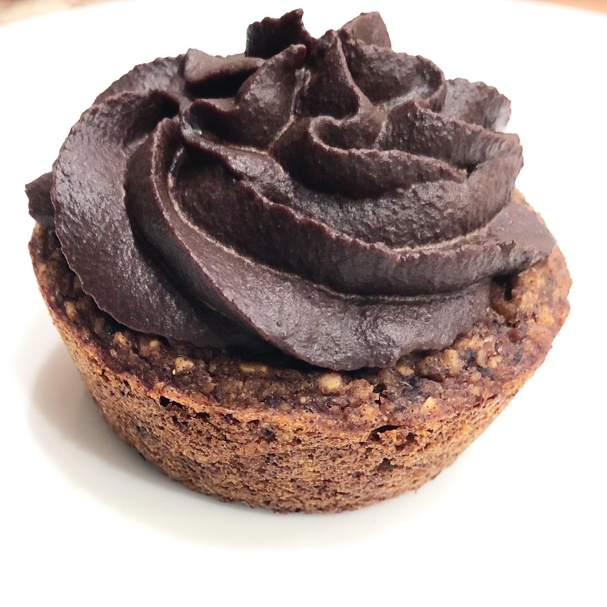

# Assignment 4

## Diesel Cakes


Nicole Pizza

Fall 2020 - MC5277

## Code Resources

Use the following code in the header of html to have inline navigation with logo:

``` html
<header>
  <nav>
  <div class="logo-container">
    <a href="index.html">
      
    </a>
  </div>
   <ul>
     <li><a href="index.html">Home</a></li>
     <li><a href="#">About</a></li>
     <li><a href="#">Contact</a></li>
   </ul>
 </nav>

</header>
```

Use the following in CSS to to align logo to the left of navigation and remove the hover from logo:

``` CSS
.logo-container {
    display: inline-block;
    float: left;
}

.logo-container a:hover {
    background: none;
}
```

(**Thank you Professor _Efren_!**)

I, Nicole Pizza, have read the point deduction list and understand that I will lose points for missing items!
